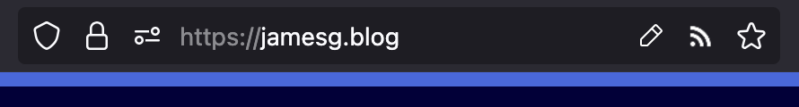

# Web Feed Finder

This extension finds RSS, Atom, ActivityStreams 2, and h-feeds on a web page.

If one is found, the extension icon will show. When clicked, the extension icon will take you to your feed reader with the feed URL.

If you open an XML document in your browser, this extension will automatically redirect you to your feed reader so you can subscribe to the feed. This prevents you from seeing an XML document on sites that link directly to XML documents for their RSS feeds.

This extension is available on:

- [Firefox](https://addons.mozilla.org/en-US/firefox/addon/web-feed-subscription-button/)

## Demo

## Contributing

Contributions are welcome!

If you have encountered a bug, please open an Issue describing the bug.

If you have an idea for a feature, please open an Issue describing your idea and whether you are willing to submit a Pull Request. Please do not submit a PR without discussing your idea with a Maintainer first.

## License

This project is licensed under an [MIT license](LICENSE).